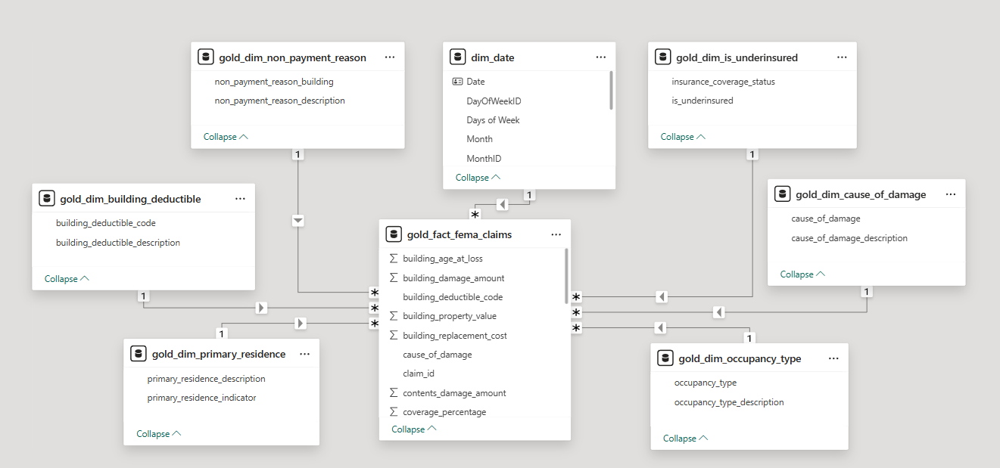
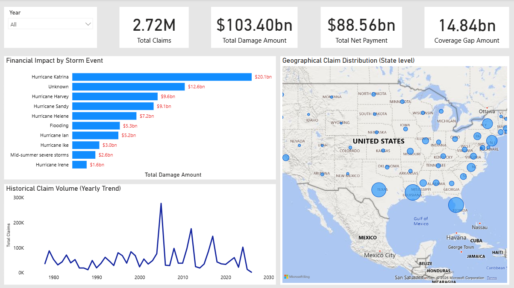
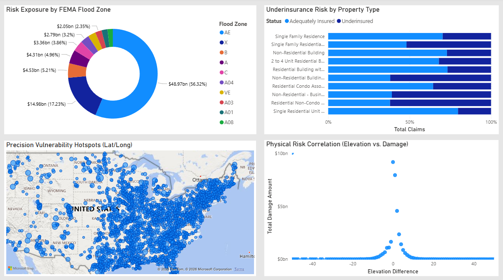
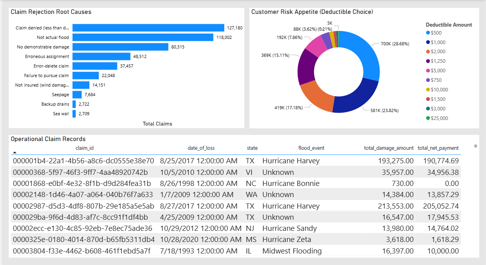

# End-to-End Data Engineering Project: FEMA Flood Insurance Claims

**⚠️ Work in Progress ⚠️** 


## Table of Contents

* [Business Case](#business-case)
* [Pipeline Architecture](#pipeline-architecture)
    * [Tech Stacks](#tech-stacks)
    * [Data Pipeline Flow](#data-pipeline-flow)
    * [Source Code Map](#source-code-map)
* [Data Quality](#data-quality)
* [Data Visualization](#data-visualization)
	* [Data Modeling](#data-modeling)
    * [Executive Overview](#executive-overview)
    * [Geospatial & Risk Analysis](#geospatial--risk-analysis)
    * [Operational & Claim Rejection Analysis](#operational--claim-rejection-analysis)
<!-- * [Challenges](#challenges)
* [Setup Instructions](#setup-instructions) -->


## Business Case

In the property and casualty insurance industry, accurate risk assessment is the primary defense against catastrophic financial losses. For stakeholders and underwriting teams, managing flood risks requires more than just high-level observation; it demands highly granular, automated, and actionable intelligence. Stakeholders within the risk management, actuarial, and claims operations teams rely on this pipeline for:

* **Optimizing** premium pricing models based on precise physical risk factors, such as property elevation and flood zone vulnerabilities.

* **Analyzing** geographic risk exposure to pinpoint vulnerability hotspots and proactively manage policy capacity in high-risk areas.

* **Identifying** systemic underinsurance behaviors across specific property portfolios to uncover targeted cross-selling and upselling opportunities.

* **Replacing** fragmented, manual data wrangling with a robust automated pipeline, allowing the team to focus on mitigating claim rejections and refining policy strategies rather than data collection.


**Data Source:** [OpenFEMA Dataset](https://www.fema.gov/openfema-data-page/fima-nfip-redacted-claims-v2)


## Pipeline Architecture


### Tech Stacks

* **GitHub Actions:** Implements a 3-stage CI/CD pipeline to enforce quality code, automate AWS infrastructure provisioning via **Terraform**, and seamlessly deploy the data workflows to production using **Databricks Asset Bundles (DABs)**.

* **Terraform:** Used as Infrastructure as Code (IaC) to automate the end-to-end provisioning of the AWS environment. This includes configuring the underlying network architecture **(VPC)**, deploying the source database **(Amazon RDS)**, and setting up the Data Lake **(Amazon S3)**, ensuring a highly reproducible and version-controlled infrastructure.

* **Amazon RDS:** The primary operational database acting as the source of truth for the raw FEMA flood insurance claims data.

* **Amazon S3:** Acts as the project's scalable Data Lake, providing highly durable object storage for landing raw data and storing processed data across the Medallion Architecture layers.

* **Databricks:** The unified Lakehouse platform serving as the core execution environment. It manages the **Delta Lake** storage format and orchestrates the end-to-end workflow via **Databricks Jobs**.

* **Apache Spark (PySpark):** The distributed data processing engine utilized within Databricks to extract, clean, transform, and logically model large-scale datasets efficiently.

* **Databricks SQL Warehouse:** A serverless compute engine used to expose the highly optimized business-level data (Gold layer) for executing complex analytical queries at high speed.

* **Power BI:** The visualization platform connected directly to the Databricks SQL Warehouse, used to create interactive dashboards and translate complex data into actionable insights.


### Data Pipeline Flow

* **Extract:** Automated data extraction from **Amazon RDS** (Data Source) using PySpark scripts. These tasks are orchestrated by **Databricks Jobs** and the extracted data is securely stored as raw files in **Amazon S3**.

* **Transform:** Data is processed within **Databricks** using **PySpark**, strictly following the **Medallion Architecture** to ensure data quality and integrity:

  * **Raw Data (Bronze):** The initial ingestion layer where data is kept in its original state to maintain an immutable historical source of truth.
  
  * **Cleaned Data (Silver):** Involves data cleansing, column standardization, explicit data type casting, handling missing values, correcting anomalous negative financial metrics, and deduplication to create a reliable foundation.
  
  * **Business-level Data (Gold):** The final analytical layer where data is logically modeled into a highly optimized **Star Schema** (1 Fact, 7 Dimension tables). This data is saved in **Delta** format and strategically partitioned, making it ready for downstream consumption.

* **Load:** The transformed Gold tables are registered in the **Databricks Unity Catalog** and exposed via **Databricks SQL Warehouse**, serving as a high-performance querying endpoint for **Power BI** visualization.


### Source Code Map

| Component | File Link (Source Code) | Description |
| :--- | :--- | :--- |
| **CI/CD Pipeline** | [`cicd.yml`](./.github/workflows/cicd.yml) | The GitHub Actions workflow that automates code validation, Terraform provisioning, and Databricks workflows deployment. |
| **Infrastructure (IaC)** | [`terraform/`](./terraform/) | Contains all Terraform configuration files (`vpc.tf`, `rds.tf`, `s3.tf`) used to provision the AWS cloud environment. |
| **Orchestration / DABs** | [`databricks.yml`](./databricks.yml) | The Databricks Asset Bundles configuration defining the environments, job schedules, and workflow dependencies. |
| **Data Ingestion (Bronze)** | [`ingest_from_rds_to_s3.py`](./scripts/ingest_from_rds_to_s3.py) | PySpark script to extract raw data from Amazon RDS and load it into the S3 Data Lake. |
| **Data Cleaning (Silver)** | [`cleaned_bronze_to_silver.py`](./scripts/cleaned_bronze_to_silver.py) | Cleanses data by standardizing column names, casting data types, handling missing values, correcting negative numerical anomalies, and removing duplicates to prepare for the Gold layer. |
| **Data Modeling (Gold - Fact)** | [`fact_silver_to_gold.py`](./scripts/fact_silver_to_gold.py) | Core PySpark logic to build the central fact table containing numerical claim metrics and foreign keys. |
| **Data Modeling (Gold - Dim)** | [`create_dimension_tables.py`](./scripts/create_dimension_tables.py) | Constructs dimension tables by mapping raw integer codes to meaningful text descriptions based on the official FEMA Data Dictionary (e.g., Occupancy Type) to complete the Star Schema. |


## Data Quality 

To ensure data reliability and maintain a single source of truth, data quality rules were embedded directly into the PySpark transformation logic, while code and infrastructure stability were guaranteed through a robust GitHub Actions pipeline.

**Silver Layer (Data Cleansing & Standardization):** 
  * **Type Casting & Column Standardization:** Applied explicit data type casting (e.g., Integer, Double, Timestamp) and converted column names to standard `snake_case` conventions for consistency.

  * **Null & Missing Value Handling:** Prevented silent failures by dropping records with missing critical identifiers (`claim_id`, `date_of_loss`), while applying logical defaults (`"Unknown"`, `"Not Applicable"`, or `0.0`) to text and numeric columns.

  * **Data Integrity Checks:** Enforced the absolute value `abs()` function on all financial metrics and physical measurements (e.g., `building_damage_amount`, `water_depth`) to correct erroneous negative values.

  * **Deduplication:** Applied `.dropDuplicates(["claim_id"])` to guarantee transaction uniqueness before partitioning the data by `year_of_loss` to optimize downstream performance.


## Data Visualization

### Data Modeling


#### Star Schema

To ensure high performance and flexible analysis, I implemented a **Star Schema** model within Power BI. This structure separates business metrics (Facts) from descriptive attributes (Dimensions), optimizing the model for the massive FEMA dataset.

 * **Fact Table:** The core metrics and foreign keys are consolidated into a single fact table: `gold_fact_fema_claims`.

 * **Dimension Tables:** Descriptive attributes are split into specialized dimensions (e.g., `gold_dim_non_payment_reason`, `gold_dim_cause_of_damage`, `gold_dim_occupancy_type`, and a custom `dim_date`) to provide precise filtering context.

#### Custom Date Dimension

I used **DAX** to create a dynamic custom `dim_date`  table instead of relying on the default system calendar. This ensures the date range automatically adapts to the minimum and maximum loss dates in the fact table, allowing for accurate time intelligence analysis.

``` M
dim_date = 
VAR startYear = YEAR(MIN('gold_fact_fema_claims'[date_of_loss]))
VAR endYear = YEAR(MAX('gold_fact_fema_claims'[date_of_loss]))
RETURN
ADDCOLUMNS(
    CALENDAR(
        DATE(startYear, 1, 1),
        DATE(endYear, 12, 31)
    ),
    "Year", YEAR([Date]),
    "Quarter", "Q" & FORMAT([Date], "q"),
    "QuarterID", QUARTER([Date]),
    "Month", FORMAT([Date], "mmm"),
    "MonthID", MONTH([Date]),
    "MonthYear", FORMAT([Date], "mmm yyyy"),
    "MonthYearID", INT(FORMAT([Date], "yyyymm")),
    "QuarterYear", "Q" & FORMAT([Date], "q yyyy"),
    "QuarterYearID", INT(FORMAT([Date], "yyyyq")),
    "Days of Week", FORMAT([Date], "ddd"),
    "DayOfWeekID", WEEKDAY([Date], 1)
)
```

#### Measures

To drive the dashboard's analytics, I created a set of foundational measures using DAX. These metrics power the KPI cards and all aggregations across the reports:

* `Total Claims` : Calculates the total volume of submitted claims.

* `Total Damage Amount` : Aggregates the assessed value of property and contents damage.

* `Total Net Payment` : Aggregates the actual compensation paid to policyholders.

To uncover deeper business insights, I developed a custom metric called `Coverage Gap Amount`, which highlights the financial risk and the deficit between the physical damage and the actual payout.

``` M
Coverage Gap Amount = 
VAR TotalDamage = SUM('gold_fact_fema_claims'[total_damage_amount]) 
VAR TotalPayment = SUM('gold_fact_fema_claims'[total_net_payment]) 

RETURN
TotalDamage - TotalPayment
```

### Executive Overview

This page serves as the control center for C-level executives, providing an immediate snapshot of the company's financial exposure and historical claim trends.



  - **Key Performance Indicators (KPIs):** Instantly highlights the massive scale of the data, processing 2.72M total claims with a staggering $103.40bn in total damage. The $14.84bn Coverage Gap immediately reveals the uninsured loss burden.

  - **Financial Impact & Historical Claim Volume:** Clearly identifies the 2005 hurricane season (driven largely by Hurricane Katrina's $20.1bn damage) as the most catastrophic event in the dataset.

  - **Geographical Claim Distribution:** A state-level bubble map visualizes the concentration of claims along the East Coast and the Gulf of Mexico, aiding in high-level capital allocation.


### Geospatial & Risk Analysis

This page shifts the focus to the underwriting and risk management teams, leveraging physical attributes and precise geospatial data to challenge existing risk models.



  - **Precision Vulnerability Hotspots (Lat/Long):** By utilizing the cleansed coordinate data instead of zip codes, this map pinpoints exact vulnerability hotspots down to the property level, moving beyond generalized state-level risks.

  - **Physical Risk Correlation (Elevation vs. Damage):** This powerful scatter plot proves the physical risk theory. It forms a clear "bell curve," demonstrating that properties built precisely at sea level (0 elevation difference) suffer exponentially higher damage amounts.

  - **Risk Exposure by FEMA Flood Zone:** While high-risk Zone AE accounts for the majority of damage, a crucial insight is that a significant portion of damage occurs in Zone X (traditionally considered a low-to-moderate risk area), signaling a critical need to update internal flood risk models.

  - **Underinsurance Risk by Property Type:** Cross-analyzes occupancy types against insurance coverage status, highlighting portfolios where policyholders are underinsured, which opens up targeted cross-selling opportunities.


### Operational & Claim Rejection Analysis

Designed for the claims and operations teams, this page investigates the root causes of denied payouts and provides actionable case-level data.



  - **Claim Rejection Root Causes:** By filtering out successful payouts, this chart exposes the primary reasons claims are denied (e.g., Damage less than deductible, Not actual flood). This insight is vital for refining policy wording and improving customer communication.

  - **Customer Risk Appetite (Deductible Choice):** Analyzes customer risk behavior by showing the most common deductible tiers chosen by policyholders (predominantly the $500 and $1,000 tiers).

  - **Operational Claim Records:** An interactive, granular matrix table that responds to cross-filtering from the charts above. It allows operational staff to drill down into specific claim IDs, storm events, and financial deficits, ready to be exported for further Excel analysis.