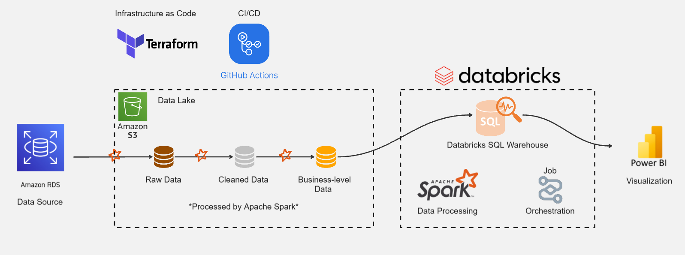

# End-to-End Data Engineering Project: FEMA Flood Insurance Claims

**⚠️ Work in Progress ⚠️** 

## Business Case

...

<!-- In the face of increasing climate volatility and extreme weather events, understanding the financial impact of floods is critical. For risk management teams, government agencies, and insurance providers, reactive analysis is no longer sufficient; it demands a proactive, scalable, and automated data intelligence pipeline. Stakeholders within the risk analytics and strategic planning teams rely on this pipeline for:

* Assessing geographical flood risks to optimize insurance premium strategies and resource allocation.
* Analyzing historical disaster trends and identifying the financial impact of severe weather events (e.g., major hurricanes).
* Evaluating the "Coverage Gap" by comparing actual property damage against net insurance payouts, and analyzing reasons for claim denials to improve future policy offerings.
* Replacing manual database extractions with a robust automated Lakehouse pipeline, allowing the team to focus on actionable insights rather than complex data wrangling. -->

<!-- ### Project Scope

To demonstrate the pipeline's capability in handling large-scale, real-world disaster records, the current scope is focused on the National Flood Insurance Program (NFIP) claims data. The system tracks and models the following key dimensions:

* **Geospatial Risk:** States, precise coordinates (Latitude/Longitude), and rated flood zones.
* **Financial Impact:** Building property values, total damage amounts, and net payment amounts.
* **Claim Diagnostics:** Core causes of damage and specific non-payment reasons.
* **Property Characteristics:** Occupancy types and building elevation differences.

*Data represents historical redacted claims to protect PII (Personally Identifiable Information).* -->

**Data Source:** [OpenFEMA Dataset](https://www.fema.gov/openfema-data-page/fima-nfip-redacted-claims-v2)

## Pipeline Architecture

### Tech Stacks

* **GitHub Actions:** Implements a 3-stage CI/CD pipeline to enforce quality code, automate AWS infrastructure provisioning via **Terraform**, and seamlessly deploy the data workflows to production using **Databricks Asset Bundles (DABs)**.

* **Terraform:** Used as Infrastructure as Code (IaC) to automate the end-to-end provisioning of the AWS environment. This includes configuring the underlying network architecture **(VPC)**, deploying the source database **(Amazon RDS)**, and setting up the Data Lake **(Amazon S3)**, ensuring a highly reproducible and version-controlled infrastructure.

* **Amazon RDS:** The primary operational database acting as the source of truth for the raw FEMA flood insurance claims data.

* **Amazon S3:** Acts as the project's scalable Data Lake, providing highly durable object storage for landing raw data and storing processed data across the Medallion Architecture layers.

* **Databricks:** The unified Lakehouse platform serving as the core execution environment. It manages the Delta Lake storage format and orchestrates the end-to-end workflow via **Databricks Jobs**.

* **Apache Spark (PySpark):** The distributed data processing engine utilized within Databricks to extract, clean, transform, and logically model large-scale datasets efficiently.

* **Databricks SQL Warehouse:** A serverless compute engine used to expose the highly optimized business-level data (Gold layer) for executing complex analytical queries at high speed.

* **Power BI:** The visualization platform connected directly to the Databricks SQL Warehouse, used to create interactive dashboards and translate complex data into actionable insights.

### Data Pipeline Flow

* **Extract:** Automated data extraction from **Amazon RDS** (Data Source) using PySpark scripts. These tasks are orchestrated by **Databricks Jobs** and the extracted data is securely stored as raw files in **Amazon S3**.

* **Transform:** Data is processed within **Databricks** using **PySpark**, strictly following the **Medallion Architecture** to ensure data quality and integrity:

  * **Raw Data (Bronze):** The initial ingestion layer where data is kept in its original state to maintain an immutable historical source of truth.
  
  * **Cleaned Data (Silver):** Involves data cleansing, column standardization, explicit data type casting, handling missing values, correcting anomalous negative financial metrics, and deduplication to create a reliable foundation.
  
  * **Business-level Data (Gold):** The final analytical layer where data is logically modeled into a highly optimized **Star Schema** (1 Fact, 5 Dimension tables). This data is saved in **Delta** format and strategically partitioned, making it ready for downstream consumption.

* **Load:** The transformed Gold tables are registered in the Databricks Hive Metastore and exposed via **Databricks SQL Warehouse**, serving as a high-performance querying endpoint for **Power BI** visualization.

### Source Code Map

| Component | File Link (Source Code) | Description |
| :--- | :--- | :--- |
| **CI/CD Pipeline** | [`cicd.yml`](./.github/workflows/cicd.yml) | The GitHub Actions workflow that automates code validation, Terraform provisioning, and Databricks workflows deployment. |
| **Infrastructure (IaC)** | [`terraform/`](./terraform/) | Contains all Terraform configuration files (`vpc.tf`, `rds.tf`, `s3.tf`) used to provision the AWS cloud environment. |
| **Orchestration / DABs** | [`databricks.yml`](./databricks.yml) | The Databricks Asset Bundles configuration defining the environments, job schedules, and workflow dependencies. |
| **Data Ingestion (Bronze)** | [`ingest_from_rds_to_s3.py`](./scripts/ingest_from_rds_to_s3.py) | PySpark script to extract raw data from Amazon RDS and load it into the S3 Data Lake. |
| **Data Cleaning (Silver)** | [`cleaned_bronze_to_silver.py`](./scripts/cleaned_bronze_to_silver.py) | Cleanses data by standardizing column names, casting data types, handling missing values, correcting negative numerical anomalies, and removing duplicates to prepare for the Gold layer. |
| **Data Modeling (Gold - Fact)** | [`fact_silver_to_gold.py`](./scripts/fact_silver_to_gold.py) | Core PySpark logic to build the central fact table containing numerical claim metrics and foreign keys. |
| **Data Modeling (Gold - Dim)** | [`create_dimension_tables.py`](./scripts/create_dimension_tables.py) | Constructs dimension tables by mapping raw integer codes to meaningful text descriptions based on the official FEMA Data Dictionary (e.g., Occupancy Type) to complete the Star Schema. |

### Data Quality 

To ensure data reliability and maintain a single source of truth, data quality rules were embedded directly into the PySpark transformation logic, while code and infrastructure stability were guaranteed through a robust GitHub Actions pipeline.

**Silver Layer (Data Cleansing & Standardization):** 
  * **Type Casting & Column Standardization:** Applied explicit data type casting (e.g., Integer, Double, Timestamp) and converted column names to standard `snake_case` conventions for consistency.

  * **Null & Missing Value Handling:** Prevented silent failures by dropping records with missing critical identifiers (`claim_id`, `date_of_loss`), while applying logical defaults (`"Unknown"`, `"Not Applicable"`, or `0.0`) to text and numeric columns.

  * **Data Integrity Checks:** Enforced the absolute value `abs()` function on all financial metrics and physical measurements (e.g., `building_damage_amount`, `water_depth`) to correct erroneous negative values.

  * **Deduplication:** Applied `.dropDuplicates(["claim_id"])` to guarantee transaction uniqueness before partitioning the data by `year_of_loss` to optimize downstream performance.

  ### Data Modeling

  ## Data Visualization